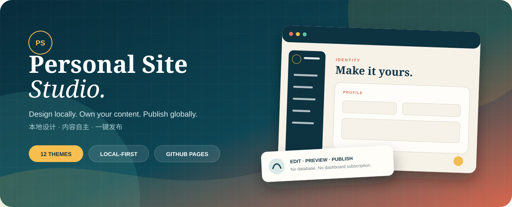
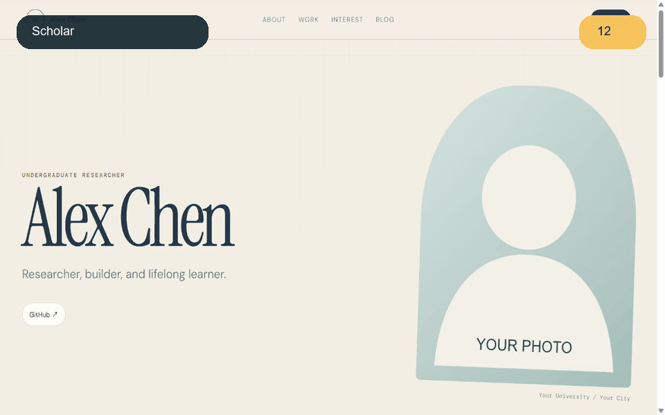
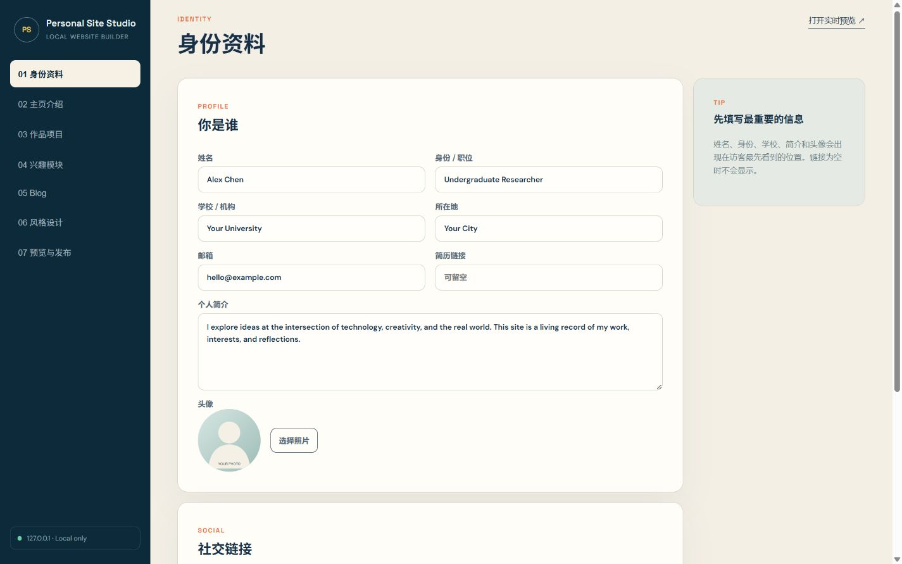
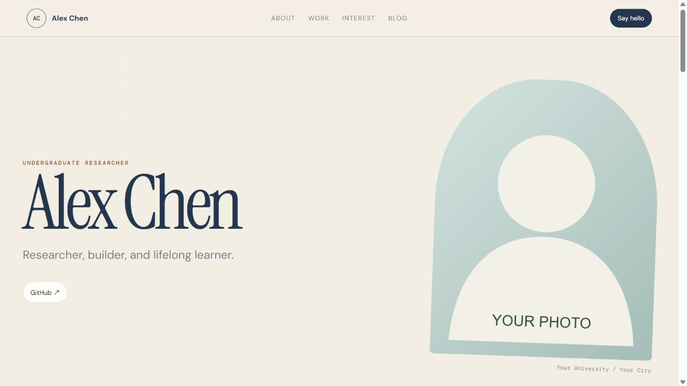
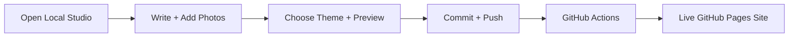
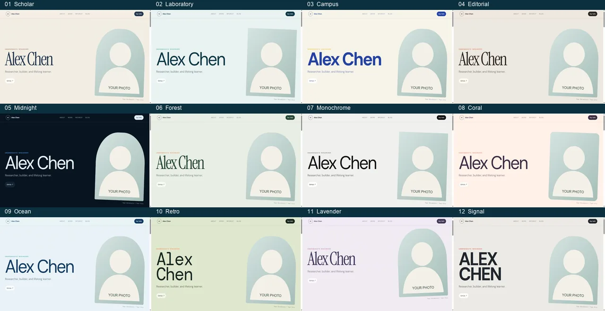
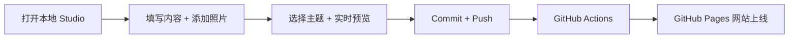

<p align="center">
  
</p>

<h1 align="center">Personal Site Studio</h1>

<p align="center">
  <strong>A local-first visual website builder for students, researchers, developers, and creators.</strong><br>
  <strong>为学生、研究者、开发者和创作者打造的本地可视化个人网站工具。</strong>
</p>

<p align="center">
  <a href="https://pigwu.github.io/personal-site-studio/"></a>
  <a href="https://github.com/pigwu/personal-site-studio/generate"></a>
  
  
</p>

<p align="center">
  <a href="#english">English</a> ·
  <a href="#中文">中文</a> ·
  <a href="https://pigwu.github.io/personal-site-studio/">Live Demo / 在线演示</a> ·
  <a href="https://github.com/pigwu/personal-site-studio/generate">Use This Template / 使用模板</a>
</p>

<p align="center">
  Fill in text, drop in photos, choose a style, and publish to GitHub Pages. No HTML, CSS, database, or paid dashboard required.<br>
  填写文字、放入照片、选择风格，然后发布到 GitHub Pages。无需编写 HTML、CSS，无需数据库，也无需付费后台。
</p>

<p align="center">
  <a href="https://pigwu.github.io/personal-site-studio/">
    
  </a>
</p>

---

<a id="english"></a>

# English

## Why Personal Site Studio?

Most portfolio templates still expect you to edit source code, configure a CMS, or hand your content to a hosted platform. Personal Site Studio keeps the workflow simple and keeps ownership with you:

- **True visual editing:** update content, drag sections, resize layouts, design backgrounds, and edit text directly on the live canvas.
- **Local-first:** the Studio listens only on `127.0.0.1`; your drafts stay on your computer.
- **Your repository, your data:** content is plain JSON and images inside your GitHub repository.
- **12 real themes:** switch from academic to playful, editorial, minimal, dark, or retro without touching CSS.
- **Flexible interests:** Running is only starter content. Turn it into Badminton, Photography, Music, Travel, Reading, Volunteering, or your own idea.
- **One-click publishing:** the Studio can commit and push managed content to `main`; GitHub Actions deploys the public site.
- **Portable and lightweight:** no database and no third-party runtime dependencies.
- **Responsive:** designed for desktop and mobile screens.
- **Live device previews:** switch the same canvas between desktop, tablet, and mobile widths before publishing.
- **Memory Map:** connect any number of chosen dates with a winding route. Every stop can contain a location, short introduction, full story, tags, and up to 12 images.
- **12 structural map styles:** Expedition, Metro, Passport, Constellation, Editorial, Polaroid, Brutalist, Glass, Terminal, Orbital, Notebook, and Museum alter the complete layout rather than only its colors.

## Build a Memory Map

1. Open **Memory Map** in the local Studio.
2. Edit the map heading, introduction, and choose one of 12 structural layouts.
3. Select **New Date** whenever you need another stop. Dates are optional until you choose them and can be freely changed.
4. Move a stop up or down to reshape the route, or delete it entirely.
5. Add a title, place, card summary, full story, tags, and multiple photographs.
6. Use **Page Builder** to move, resize, recolor, hide, or give the complete Memory Map section a custom background.
7. Save locally, inspect desktop/tablet/mobile previews, then publish.

The map is not conference-specific: use it for conferences, research trips, races, travel, a semester, a relationship, a creative project, or any sequence of moments.

## See The Workflow

| Edit locally in the Studio | Publish a responsive personal site |
| --- | --- |
|  |  |



## 12 Built-In Themes

<p align="center">
  
</p>

| Theme | Best for | Visual direction |
| --- | --- | --- |
| Classic Scholar | Academic profiles and researchers | Warm paper, serif type, restrained details |
| Modern Laboratory | AI, computer science, and engineering | Cool technical grid and laboratory energy |
| Young Campus | Students and campus communities | Bright, optimistic, and energetic |
| Editorial Journal | Writers, photographers, and blogs | Magazine rhythm and strong storytelling |
| Midnight Research | Technical work and dark-mode fans | Deep canvas with electric-blue signals |
| Forest Fieldnotes | Outdoor and environmental work | Natural greens and field-note character |
| Monochrome Minimal | Precise portfolios | Sharp black, white, and disciplined spacing |
| Coral Creative | Designers, makers, and creators | Friendly coral accents and playful warmth |
| Ocean Blue | Broad professional use | Calm, open, and polished |
| Retro Computing | Developers and hackers | Terminal-inspired typography and retro color |
| Soft Lavender | Arts and humanities | Gentle, expressive, and refined |
| Signal Red | Bold young profiles | High contrast with a confident red signal |

Every theme supports custom **primary**, **accent**, and **background** colors from the Studio.

## Quick Start

### 1. Create your repository

1. Sign in to GitHub.
2. Click **[Use this template](https://github.com/pigwu/personal-site-studio/generate)**.
3. Choose **Create a new repository**.
4. For a root personal site, name it `YOUR_USERNAME.github.io`.
5. For a project site, use any name, such as `my-personal-site`.
6. Select **Public** for the simplest free GitHub Pages setup.

### 2. Clone it to your computer

With GitHub Desktop:

1. Open your new repository on GitHub.
2. Select **Code → Open with GitHub Desktop**.
3. Pick a local folder and select **Clone**.

Or use the terminal:

```bash
git clone https://github.com/YOUR_USERNAME/YOUR_REPOSITORY.git
cd YOUR_REPOSITORY
```

### 3. Install Node.js

Install the current LTS release from [nodejs.org](https://nodejs.org/), then verify it:

```bash
node --version
```

There is no need to run `npm install`. The Studio uses only built-in Node.js modules.

### 4. Launch the Studio

On Windows, double-click:

```text
start-studio.cmd
```

On Windows, macOS, or Linux, run:

```bash
npm run studio
```

Then open [http://127.0.0.1:4174](http://127.0.0.1:4174). Keep the terminal window open while editing.

## Studio Guide

### 01 Identity

Edit your name, role, institution, location, email, short bio, avatar, resume link, and social links. Empty links are automatically hidden from the public site. Uploaded JPG, PNG, and WebP images are resized in the browser and stored as WebP when possible.

### 02 Home and About

Control the site title, one-line tagline, About heading, long introduction, and highlight cards such as Focus, Location, or Status. Separate introduction paragraphs with a blank line.

### 03 Projects

Add research, software, course work, designs, internships, or collaborations. Each project can include a title, category, description, link, tags, and cover image.

### 04 Flexible Interest

This module is not hard-coded to running. Rename the interest, rewrite its headline, choose statistics, add dated entries, upload multiple photos, and define custom metrics for every entry.

**Example: change Running into Badminton**

1. Open **Interest**.
2. Set the interest name to `Badminton`.
3. Try the headline `Speed, strategy, and the joy of every rally.`
4. Add stats such as `Weekly Training = 3 sessions`, `Favorite Event = Men's Doubles`, and `Club = University Badminton Club`.
5. Create an entry named `Campus Badminton Tournament`.
6. Upload match photos.
7. Add metrics such as `Result = Quarterfinal`, `Format = Men's Doubles`, and `Matches = 4`.
8. Save and open the live preview.

Use the same pattern for photography collections, performances, travel journals, reading lists, or volunteering.

### 05 Blog

Create posts with a title, date, tags, excerpt, body, and multiple images. Posts are stored in `public/data/content.json`; uploaded media lives in `public/assets/uploads/`.

### 06 Visual Page Builder

Open **Visual Page Builder** to design the page while looking at the real website:

1. Drag the section cards in the left Layers panel to change their order. The arrow buttons provide an accessible alternative for touchscreens and keyboards.
2. Click any section in the live canvas to select it.
3. Click a heading, paragraph, stat, project title, or blog title directly in the canvas and type. The corresponding form field updates immediately.
4. Use the right inspector to control each section's visibility, content width, left/center/right alignment, minimum height, vertical spacing, and corner radius.
5. Give any section its own solid color, gradient, or uploaded image background, plus custom text and accent colors.
6. Design the whole page background with a solid color, gradient, uploaded image, and optional grid, dot, or noise texture.
7. Choose no motion, a subtle reveal, or a bold reveal animation.
8. Switch between **Desktop**, **Tablet**, and **Mobile** without leaving the editor.
9. Select **Save design** when the result feels right.

The builder intentionally uses responsive sections instead of free absolute coordinates. You still control order, width, height, spacing, alignment, and appearance, while the layout remains usable on phones.

### 07 Theme and Color

Select any theme card, then optionally override its primary, accent, and background colors. Choose **Use theme defaults** to restore the original palette.

### 08 Preview and Publish

1. Select **Open live preview** and review the site.
2. Return to **Preview and Publish**.
3. Enter a short commit message.
4. Select **Commit + Push to main**.

For safety, the Studio publish action manages only:

- `public/data/content.json`
- Files uploaded into `public/assets/uploads/`

Manual code changes are not silently included in a Studio content commit.

## Enable GitHub Pages

This is required once for each new repository:

1. Open **Settings** in your GitHub repository.
2. Select **Pages** in the sidebar.
3. Under **Build and deployment**, set **Source** to **GitHub Actions**.
4. Push to `main` or manually run **Deploy Personal Site** from the Actions tab.
5. Wait for the workflow to turn green.

Your URL will be:

- Root site: `https://YOUR_USERNAME.github.io/`
- Project site: `https://YOUR_USERNAME.github.io/YOUR_REPOSITORY/`

The site uses relative paths, so both forms work.

## Project Structure

```text
personal-site-studio/
|-- public/                    # The only directory deployed to GitHub Pages
|   |-- index.html             # Public site structure
|   |-- styles.css             # Responsive layout and theme presentation
|   |-- app.js                 # Content renderer
|   |-- data/
|   |   |-- content.json       # All editable site content
|   |   `-- themes.json        # The 12 theme definitions
|   `-- assets/uploads/        # Images uploaded from the Studio
|-- studio/                    # Local-only visual editor
|   |-- server.js
|   `-- public/
|-- .github/workflows/         # Automatic GitHub Pages deployment
|-- start-studio.cmd           # Windows launcher
`-- README.md
```

## Privacy and Security

- The Studio binds to `127.0.0.1`, not your public network interface.
- The `studio/` directory is never included in the deployed Pages artifact.
- No database, analytics service, or GitHub token file is required.
- Publishing uses the Git credentials already configured on your computer.
- Your public content and photos stay in your own repository.
- Never upload private addresses, identity documents, phone numbers, or photos you do not want made public.

## Troubleshooting

<details>
<summary><strong>The browser does not open after launching</strong></summary>

Keep the terminal window open and manually visit [http://127.0.0.1:4174](http://127.0.0.1:4174).
</details>

<details>
<summary><strong>Node.js was not found</strong></summary>

Install the LTS release from [nodejs.org](https://nodejs.org/), then reopen your terminal.
</details>

<details>
<summary><strong>Port 4174 is already in use</strong></summary>

The Studio may already be running. Open [http://127.0.0.1:4174](http://127.0.0.1:4174), or choose another port:

```powershell
$env:SITE_STUDIO_PORT=5000
npm run studio
```
</details>

<details>
<summary><strong>Publishing says the current branch is not main</strong></summary>

Run `git switch main`, then restart the Studio.
</details>

<details>
<summary><strong>GitHub asks you to sign in when pushing</strong></summary>

Sign in with GitHub Desktop, or install GitHub CLI and run `gh auth login`.
</details>

<details>
<summary><strong>Actions succeeded, but the site looks unchanged</strong></summary>

Wait one or two minutes, refresh with `Ctrl + F5`, and confirm that **Settings → Pages → Source** is set to **GitHub Actions**.
</details>

## Development

The project uses plain HTML, CSS, JavaScript, and Node.js. Run syntax checks with:

```bash
npm run check
```

Issues and pull requests for new themes, modules, translations, and accessibility improvements are welcome.

---

<a id="中文"></a>

# 中文

## 为什么选择 Personal Site Studio？

许多个人网站模板仍然要求你直接修改源码、配置 CMS，或者把内容交给第三方托管平台。Personal Site Studio 将流程保持简单，也将网站的所有权真正留给你：

- **真正的可视化编辑：** 在实时画布中改内容、拖动模块、调整尺寸、设计背景，并直接点击文字输入。
- **本地优先：** Studio 只监听 `127.0.0.1`，草稿留在你的电脑上。
- **数据属于你：** 内容是 GitHub 仓库内的普通 JSON 文件和图片。
- **12 套真实主题：** 无需修改 CSS，即可在学术、年轻、杂志、极简、暗色和复古风格之间切换。
- **自由兴趣模块：** Running 只是示例，你可以改成 Badminton、Photography、Music、Travel、Reading、Volunteering 或任何主题。
- **一键发布：** Studio 可以将管理范围内的内容提交并推送到 `main`，GitHub Actions 自动部署公开网站。
- **轻量且可迁移：** 不需要数据库，也没有第三方运行依赖。
- **响应式设计：** 同时适配桌面和移动设备。
- **多设备实时预览：** 发布前可以在同一画布切换桌面、平板和手机宽度。

## 工作流程

| 在本地 Studio 编辑 | 发布响应式个人网站 |
| --- | --- |
|  |  |



## 12 套内置主题

<p align="center">
  
</p>

| 主题 | 适合场景 | 视觉特点 |
| --- | --- | --- |
| Classic Scholar | 学术主页、研究者 | 暖色纸张、衬线字体、克制稳重 |
| Modern Laboratory | AI、计算机、工程 | 技术网格、冷色、实验室感 |
| Young Campus | 本科生、社团、年轻作品集 | 明快、活泼、校园感 |
| Editorial Journal | 写作者、摄影、Blog | 杂志排版、强调叙事 |
| Midnight Research | 技术项目、深色偏好 | 深色背景、电光蓝信号 |
| Forest Fieldnotes | 户外、环境、生命科学 | 自然绿、田野笔记感 |
| Monochrome Minimal | 极简作品集 | 黑白、高对比、精确留白 |
| Coral Creative | 设计师、创作者 | 珊瑚色、友好、有活力 |
| Ocean Blue | 通用专业主页 | 开放、平静、可靠 |
| Retro Computing | 开发者、黑客文化 | 终端字体、复古计算机感 |
| Soft Lavender | 艺术、人文、柔和表达 | 淡紫、细腻、舒缓 |
| Signal Red | 年轻、强个性主页 | 高对比红色、醒目大胆 |

每个主题都支持在 Studio 中自定义**主色、强调色和背景色**。

## 快速开始

### 1. 创建自己的仓库

1. 登录 GitHub。
2. 点击 **[Use this template](https://github.com/pigwu/personal-site-studio/generate)**。
3. 选择 **Create a new repository**。
4. 如果要创建根域名个人主页，将仓库命名为 `你的用户名.github.io`。
5. 如果要创建普通项目网站，可以使用 `my-personal-site` 等任意名称。
6. 建议选择 **Public**，这样免费 GitHub Pages 的设置最简单。

### 2. 下载到电脑

使用 GitHub Desktop：

1. 打开刚创建的 GitHub 仓库。
2. 选择 **Code → Open with GitHub Desktop**。
3. 选择本地保存位置，然后点击 **Clone**。

也可以使用命令行：

```bash
git clone https://github.com/你的用户名/你的仓库名.git
cd 你的仓库名
```

### 3. 安装 Node.js

从 [nodejs.org](https://nodejs.org/) 安装当前 LTS 版本，然后检查：

```bash
node --version
```

本项目无需运行 `npm install`，Studio 只使用 Node.js 内置模块。

### 4. 打开本地 Studio

Windows 用户可以直接双击：

```text
start-studio.cmd
```

Windows、macOS 或 Linux 也可以在终端运行：

```bash
npm run studio
```

然后打开 [http://127.0.0.1:4174](http://127.0.0.1:4174)。编辑期间请保持终端窗口开启。

## Studio 使用指南

### 01 身份资料

修改姓名、身份、学校或机构、所在地、邮箱、个人简介、头像、简历链接和社交链接。链接为空时不会显示在公开网站中。上传的 JPG、PNG 和 WebP 图片会在浏览器端缩放，并尽可能以 WebP 格式保存。

### 02 主页与介绍

控制网站标题、一句话介绍、About 标题、详细介绍，以及 Focus、Location、Status 等信息亮点。详细介绍中空一行即可创建新段落。

### 03 作品项目

添加研究、软件、课程作业、设计作品、实习成果或合作项目。每个项目都可以包含标题、分类、介绍、链接、标签和封面图。

### 04 自由兴趣模块

这个模块并不固定为跑步。你可以修改兴趣名称、主标题、介绍和数据亮点；添加带日期的经历；上传多张照片；并为每条经历定义自己的指标。

**示例：将 Running 改成 Badminton**

1. 打开 **兴趣模块**。
2. 将兴趣名称改为 `Badminton`。
3. 将主标题改为 `Speed, strategy, and the joy of every rally.`。
4. 添加 `Weekly Training = 3 sessions`、`Favorite Event = Men's Doubles`、`Club = University Badminton Club` 等数据。
5. 新建 `Campus Badminton Tournament` 记录。
6. 上传比赛照片。
7. 添加 `Result = Quarterfinal`、`Format = Men's Doubles`、`Matches = 4` 等指标。
8. 保存并打开实时预览。

使用同样的方法，可以制作摄影作品记录、音乐演出、旅行日记、读书清单或志愿活动页面。

### 05 Blog

创建带有标题、日期、标签、摘要、正文和多张图片的文章。文章保存在 `public/data/content.json`，上传的图片保存在 `public/assets/uploads/`。

### 06 页面设计器

打开 **页面设计器**，就可以看着真实网页完成设计：

1. 拖动左侧 Layers 中的模块卡片改变网页顺序；触摸屏和键盘用户也可以使用上移、下移按钮。
2. 点击画布中的任意模块，将它设为当前编辑对象。
3. 点击画布中的标题、正文、数据、项目标题或 Blog 标题，直接输入文字；旧表单中的对应字段也会立即同步。
4. 在右侧调整每个模块的显示状态、内容宽度、左中右对齐、最小高度、上下留白和圆角。
5. 为任意模块设置独立的纯色、渐变或上传图片背景，并覆盖文字色和强调色。
6. 设计整个页面的背景，支持纯色、渐变、上传图片，以及网格、圆点和噪点纹理。
7. 选择关闭动画、轻柔进入或大胆进入效果。
8. 不离开编辑器即可切换 **Desktop、Tablet、Mobile** 三种实时画布。
9. 完成后点击 **保存设计**。

设计器采用响应式模块，而不是随意的绝对坐标。这样仍然可以自由控制顺序、宽度、高度、间距、对齐和外观，同时避免电脑上排好的页面在手机上完全错位。

### 07 主题与配色

点击任意主题卡片即可切换主题，还可以覆盖其主色、强调色和背景色。点击 **使用主题默认配色** 可以恢复原始颜色。

### 08 预览与发布

1. 点击 **打开实时预览** 检查网站。
2. 回到 **预览与发布**。
3. 填写一条简短的 Commit 信息。
4. 点击 **Commit + Push 到 main**。

为了降低误操作风险，Studio 发布按钮只管理：

- `public/data/content.json`
- `public/assets/uploads/` 中由 Studio 上传的文件

你手动修改的程序代码不会被悄悄加入 Studio 的内容提交中。

## 启用 GitHub Pages

每个新仓库只需要设置一次：

1. 打开 GitHub 仓库的 **Settings**。
2. 在左侧选择 **Pages**。
3. 在 **Build and deployment** 中将 **Source** 设置为 **GitHub Actions**。
4. Push 到 `main`，或者在 Actions 页面手动运行 **Deploy Personal Site**。
5. 等待工作流变成绿色。

网站地址为：

- 用户主页仓库：`https://你的用户名.github.io/`
- 普通项目仓库：`https://你的用户名.github.io/你的仓库名/`

网站使用相对路径，因此两种形式都支持。

## 文件结构

```text
personal-site-studio/
|-- public/                    # 唯一会部署到 GitHub Pages 的目录
|   |-- index.html             # 公开网站结构
|   |-- styles.css             # 响应式布局与主题样式
|   |-- app.js                 # 网站内容渲染
|   |-- data/
|   |   |-- content.json       # 全部可编辑网站内容
|   |   `-- themes.json        # 12 套主题定义
|   `-- assets/uploads/        # Studio 上传的图片
|-- studio/                    # 仅在本地运行的可视化编辑器
|   |-- server.js
|   `-- public/
|-- .github/workflows/         # GitHub Pages 自动部署
|-- start-studio.cmd           # Windows 双击启动
`-- README.md
```

## 创建回忆地图

1. 在本地 Studio 中打开“回忆地图”。
2. 修改标题和介绍，并从 12 种整体布局中选择一种。
3. 点击“新日期”自由添加节点；日期可以稍后选择、随时修改，也可完全删除。
4. 使用“上移 / 下移”调整路线叙事顺序。
5. 为每一天填写地点、摘要、完整故事和标签，并上传多张照片。
6. 在“页面设计器”中继续调整整个回忆地图模块的位置、宽度、高度、颜色、背景和显示状态。
7. 本地保存并检查桌面、平板和手机预览，确认后发布。

回忆地图不限于会议：它也可以记录科研旅行、比赛、大学生活、旅行、项目过程，或任何你想串联起来的时刻。

## 安全与隐私

- Studio 只监听 `127.0.0.1`，不会绑定公共网络接口。
- `studio/` 不会被包含在 GitHub Pages 部署文件中。
- 不需要数据库、分析服务或保存 GitHub Token 的文件。
- 发布使用电脑上已有的 Git 凭据。
- 公开内容和照片保存在你自己的仓库中。
- 不要上传住址、身份证件、私人电话号码或不希望公开的照片。

## 常见问题

<details>
<summary><strong>启动后浏览器没有自动打开</strong></summary>

保持终端窗口开启，手动访问 [http://127.0.0.1:4174](http://127.0.0.1:4174)。
</details>

<details>
<summary><strong>提示 Node.js was not found</strong></summary>

从 [nodejs.org](https://nodejs.org/) 安装 LTS 版本，然后重新打开终端。
</details>

<details>
<summary><strong>端口 4174 已被使用</strong></summary>

Studio 可能已经启动，可以直接打开 [http://127.0.0.1:4174](http://127.0.0.1:4174)，或者更换端口：

```powershell
$env:SITE_STUDIO_PORT=5000
npm run studio
```
</details>

<details>
<summary><strong>发布时提示当前分支不是 main</strong></summary>

运行 `git switch main`，然后重新启动 Studio。
</details>

<details>
<summary><strong>Push 时 GitHub 要求登录</strong></summary>

登录 GitHub Desktop，或者安装 GitHub CLI 后运行 `gh auth login`。
</details>

<details>
<summary><strong>Actions 已成功，但网站看起来没有变化</strong></summary>

等待一到两分钟，使用 `Ctrl + F5` 强制刷新，并确认 **Settings → Pages → Source** 已设置为 **GitHub Actions**。
</details>

## 参与开发

项目只使用原生 HTML、CSS、JavaScript 和 Node.js。运行语法检查：

```bash
npm run check
```

欢迎提交 Issue 或 Pull Request，增加新主题、新模块、翻译和无障碍改进。

---

<p align="center">
  <strong>Your story deserves a website that feels like you.</strong><br>
  <strong>你的故事，值得一个真正像你的网站。</strong>
</p>

<p align="center">
  <a href="https://github.com/pigwu/personal-site-studio/generate"><strong>Create your site / 创建你的网站</strong></a>
  ·
  <a href="https://pigwu.github.io/personal-site-studio/"><strong>Live demo / 在线演示</strong></a>
</p>

## License / 许可证

[MIT](LICENSE) © 2026 Yunzhi WU
